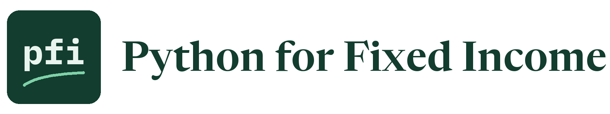

<div align="center">

<picture>
  <source media="(prefers-color-scheme: dark)" srcset="assets/readme/wordmark-dark.png">
  
</picture>


[](LICENSE)
[](LICENSE-CONTENT)

**[Start here](#start-here)** &nbsp;·&nbsp; **[Coming from Excel](#if-you-know-excel-you-already-know-how-to-think-about-this)** &nbsp;·&nbsp; **[The courses](#the-courses)** &nbsp;·&nbsp; **[How a day works](#how-a-day-works)** &nbsp;·&nbsp; **[The data](#the-data)** &nbsp;·&nbsp; **[License](#license)**

## From Fixed Income to Python: A Practical Guide for Fixed Income Professionals

</div>

You know what a coupon is. You understand spread, duration, yield, and credit. You live in Excel. You understand the business, but you have never written a line of code.

**That's exactly where this course begins.**

Most Python courses teach programming through shopping carts, movie ratings, and toy datasets. This one teaches Python through the work of a credit desk.

Your first object is a bond. Your first loop totals a portfolio. Your first data table is a holdings file. Your first analysis answers a question you already know how to ask.

Nothing is abstracted away into contrived examples. Every programming concept is introduced in the context of fixed income, portfolio management, and credit analysis, so you learn the code and immediately understand why it matters.

You already know the investment problem. **This course teaches you how to solve more of it with code.**

The series starts with [Course 1, Python Foundations](course1_python_foundations/README.md): four weeks, one notebook a day. It is being built in order, and its course map shows which days are ready.

> This course is educational content created in a personal capacity. Nothing here is investment advice or a recommendation to buy or sell any security. All portfolio data is synthetic.

## If you know Excel, you already know how to think about this

Nothing in this course asks you to forget Excel. Every new idea is introduced next to the Excel feature you would reach for today, with the formula written out, so you are translating something you know and not learning from nothing.

| In Excel you would | In Python you will | Where in Course 1 |
|:---|:---|:---|
| Fill a formula down a column | Write the formula once, in a loop or on a whole array | Week 1, Day 1 and Week 2, Day 1 |
| Write a nested `IF` | Write `if`, `elif`, `else`, one test per line | Week 1, Day 1 |
| See `#N/A`, `#DIV/0!`, or `#NAME?` in a cell | Read an error that names the line and the cause | Week 1, Day 3 |
| Turn on AutoFilter and sort a sheet | Filter and sort a table by condition | Week 2, Day 2 |
| Use `SUMIF` and `COUNTIF` | Filter, then sum or count | Week 2, Day 2 and Day 5 |
| Use `COUNTBLANK` and Remove Duplicates | Count missing values and repeated rows in one line each | Week 2, Day 4 |
| Use `VLOOKUP` or `INDEX` and `MATCH` | Merge two tables on a shared column | Week 2, Day 3 and Day 5 |
| Build a pivot table | Group by a column and summarize | Week 2, Day 3 and Day 5 |
| Use `SUMPRODUCT` over `SUM` for a weighted average | Do the same arithmetic on two columns | Week 2, Day 3 and Day 5 |
| Insert a chart: Column, Line, Scatter, Histogram, Box and Whisker | Draw the same chart in a few lines, and redraw it on next month's file | Week 3, Day 1 |
| Add a trendline, and use `SLOPE`, `INTERCEPT`, and `RSQ` | Fit the line and print its numbers with units | Week 3, Day 2 |
| Use Remove Duplicates, `TRIM`, and `QUARTILE.INC` to clean and check a sheet | Find and fix the same problems in code, and print the totals before and after | Week 3, Day 3 |
| Use `XLOOKUP` by date, and `AVERAGEIFS` by year | Select by date and group a time series by year | Week 3, Day 4 |
| Net buys against sells with two `SUMIFS`, and keep a running total | Sign the sells, group, and take a cumulative sum | Week 3, Day 5 |
| Use `AVERAGEIF` on a column of 0s and 1s to get a rate by group | Group, then take the mean and the count together | Week 4, Day 1 |
| Use `FIND`, `SUBSTITUTE`, `TRIM`, and Find and Replace on text | Search and clean text with patterns, across every row at once | Week 4, Day 2 |
| Count words from a list with `SUMPRODUCT`, and standardize with `STANDARDIZE` | Score every document against a word list and compare the scores | Week 4, Day 3 |

What changes is what you get to keep. A spreadsheet holds the answer. Code holds the steps that produced it, so tomorrow's file runs through the same steps without anyone dragging a formula or repointing a range.

## Start here

There are two ways to run the notebooks. Pick one.

### Run in Google Colab, with nothing to install

Open any notebook in the [Course 1 map](course1_python_foundations/README.md#course-map) and click the **Open in Colab** badge at the top. Colab runs in your browser and needs only a Google account.

Use Colab on a personal account, with the course data only. Do not upload anything from your employer.

### Run on your own Windows machine

You need [Python 3.13](https://www.python.org/downloads/), [VS Code](https://code.visualstudio.com/) with the Python and Jupyter extensions, and [git](https://git-scm.com/downloads). On a work machine, check your firm's policy before installing anything.

**Step 1.** Get the course and open its folder.

```powershell
cd $HOME\projects
git clone https://github.com/lenamonj/python-fixed-income.git
cd python-fixed-income
```

**Step 2.** Create an environment and install what Course 1 needs. Each course folder has its own `requirements.txt`.

```powershell
python -m venv .venv
.venv\Scripts\Activate.ps1
python -m pip install -r course1_python_foundations\requirements.txt
```

**Step 3.** Open the folder in VS Code.

```powershell
code .
```

Open `course1_python_foundations\week1\day1\01_python_for_fixed_income_intro.ipynb`, choose the `.venv` kernel in the top right, and run the first cell.

If PowerShell says running scripts is disabled, run `Set-ExecutionPolicy -Scope CurrentUser RemoteSigned` once and repeat Step 2.

## How a day works

Inside a course, each day has its own folder, and each folder holds three files with the same name.

| File | What it is |
|:---|:---|
| `NN_name.ipynb` | The notebook. Work through it top to bottom. |
| `NN_name_overview.pdf` | A short slide overview of the day's ideas. Read it first. |
| `NN_name_solutions.ipynb` | Worked answers to the exercises. Try each one yourself before you look. |

Every notebook teaches the same way.

| Step | What happens |
|:---|:---|
| **A question** | A question the desk would ask, marked `Q.` |
| **A few lines of code** | A small cell that answers it, with a comment on each step. |
| **The takeaway** | One line on what the output shows. |

Four habits run through every day.

| Habit | What it means |
|:---|:---|
| **Excel side by side** | Wherever Excel has a function or feature for the job, it is shown next to the Python, formula included. |
| **Errors on purpose** | Code that fails is run for real, and the error is read line by line. |
| **Exercises you can check** | Each exercise has a check cell that tells you whether your answer is right. |
| **The AI check** | Each day ends with code written in the style of an AI assistant. It has one bug. You find it by checking the output against a number you worked out yourself. |

That last habit is the point of the course. You will use AI assistants to write code. Code that runs is not the same as code that is right, and the way to tell the difference is to know what the answer should be.

## The courses

Each course has its own folder, its own course map, and its own list of what to install. Weeks start again at 1 in every course.

| Course | What it covers | Status |
|:---:|:---|:---:|
| 1 | [Python Foundations](course1_python_foundations/README.md): variables to pandas, charts, exploratory data analysis, and a project, in four weeks | In progress |
| 2 | Bond Math: pricing, yield, duration, and convexity, built by hand and checked against Excel | Planned |

More courses are planned after these.

## The data

Every issuer, ticker, CUSIP, price, position, trade, and counterparty in the portfolio files is invented. The courses share one invented portfolio. No real company and no real security appears in any holdings file.

| File | What it holds |
|:---|:---|
| `data/holdings.csv` | 200 bonds: price, accrued interest, yield, spread, duration, DTS, par held, and market value |
| `data/benchmark.csv` | 821 bonds from 150 issuers, with index weights |
| `data/issuers.csv` | One row per issuer: ticker, name, sector, and rating |
| `data/ratings.csv` | The rating scale, with a score, a bucket, and investment grade or high yield |
| `data/positions.csv` | A lean version of the holdings, for joining to the other tables |
| `data/holdings_messy.csv` | The holdings with problems planted on purpose, for the data cleaning lessons |
| `data/holdings_messy_answer_key.md` | Every planted problem, listed |
| `data/trade_blotter.csv` | 374 trades in September 2026, in bonds from the holdings, with invented counterparties |
| `data/project_holdings.csv` | The course project's extract: the same desk one month later, as of 2026-10-30, with new problems planted in it |
| `data/project_cover_note.txt` | The cover note that comes with the project extract, with its control totals |
| `data/project_answer_key.md` | Every problem planted in the project extract. Read it after you finish |

The data is built to behave like a real portfolio.

| Rule | What it means |
|:---|:---|
| **Price and yield always agree** | Each yield is a synthetic Treasury yield plus a spread, and each price is calculated from that yield. |
| **One convention throughout** | Fixed-rate bullet bonds, semiannual coupons, 30/360 day count, modified duration. |
| **Identical for every student** | Seeded scripts generate every file: `tools/make_holdings.py` for the portfolio, `tools/make_blotter.py` for the trades, and `tools/make_project_data.py` for the project extract. |
| **Checked** | `python -m pytest` confirms the identifiers are valid and that each bond's price, accrued interest, and duration match its yield. |
| **No real CUSIPs** | Every CUSIP uses an issuer number in the range reserved for internal use, with a valid check digit. |

Three files are real, public data, and they are not part of the portfolio. Their values are unchanged.

| File | What it holds | Source and terms |
|:---|:---|:---|
| `data/treasury_par_yields.csv` | Daily Treasury par yield curve rates, 2015-01-02 to 2026-10-02, 14 tenors | U.S. Department of the Treasury, [Daily Treasury Par Yield Curve Rates](https://home.treasury.gov/resource-center/data-chart-center/interest-rates/TextView?type=daily_treasury_yield_curve). Listed by Treasury as public data under a public-domain dedication. |
| `data/credit_card_default.csv` | 30,000 credit card accounts in Taiwan in 2005, with whether each defaulted the following month | Yeh, I. (2009). Default of Credit Card Clients [Dataset]. UCI Machine Learning Repository. https://doi.org/10.24432/C55S3H. Licensed under [CC BY 4.0](https://creativecommons.org/licenses/by/4.0/). Changes: the extra header row was dropped and the file was saved as CSV. |
| `data/fomc_statements.csv` | The 46 FOMC post-meeting statements from 2021-01-27 to 2026-09-16 | Board of Governors of the Federal Reserve System, [federalreserve.gov](https://www.federalreserve.gov/monetarypolicy/fomccalendars.htm). The Board states that information on its website is in the public domain unless otherwise indicated. Only white space was changed. |

All three were retrieved on 2026-10-03. The scripts `tools/get_treasury_yields.py`, `tools/get_credit_card_default.py`, and `tools/get_fomc_statements.py` download each one again from the same source.

## What is in this repo

```
python-fixed-income/
  course1_python_foundations/
    README.md           the course map
    requirements.txt    what the course's notebooks need
    week1/ ... week4/
      day1/ ... day5/   the notebook, its solutions, and its overview PDF
  data/                 the invented portfolio, shared by every course
  tools/                the scripts that build or download the data, and the notebook banner
  tests/                checks on the data
  assets/               fonts and images
```

## License

Code is released under the [MIT License](LICENSE). The notebooks' written content, the slide overviews, and the videos are released under [CC BY 4.0](LICENSE-CONTENT): you may share and adapt them, including commercially, as long as you give credit.

The three public data files keep their own terms, listed in [The data](#the-data). They are not relicensed by this repo.

The fonts in `assets/fonts` are under the SIL Open Font License, and their license files sit beside them.

---

<div align="center">

Created by **Jeff Lenamon**

</div>
